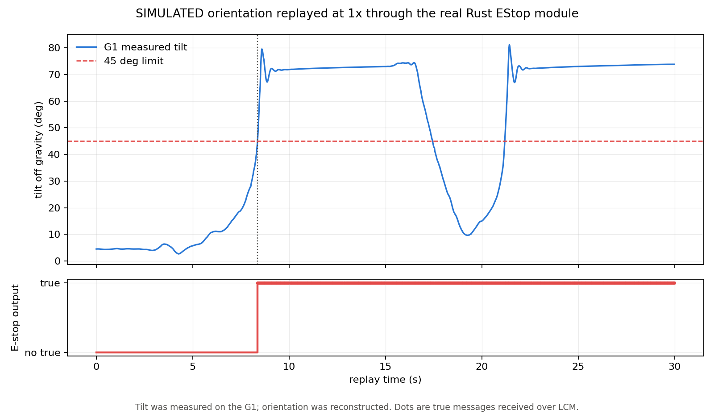

# E-stop module

- PRD: https://linear.app/dimensional/project/e-stop-module-dce7e0091e2e
- Tech spec: https://github.com/dimensionalOS/dimos/issues/3621
- Branch: `aaryan/estop-rust`

## Decisions

Condition 1 is manual stop and condition 2 is humanoid fall detection; either condition sets one latch, only a healthy manual reset clears it, and reset never starts the robot.

Each embodiment owns an E-stop defaults bundle that every root blueprint composes.

## Verification

The real Rust module replayed 1,401 samples over LCM at recorded speed, publishing its first `true` at 8.3712 s and staying latched through recovery and a second fall.

The tilt was measured on a G1, but the orientation is **SIMULATED** because the raw quaternion recording remains on the offline robot.

## Review feedback from Sam (dimos issue 3621, 2026-08-24)

Sam asked where `max_tilt_deg` comes from, and pushed on whether the interface covers conditions
more complex than a number threshold, for example an arm pose that would damage the robot or injure
someone. His sharpest point: you could expose a bool, but then you need a guarantee that the code
updating that bool is still running, so you probably need a timestamp too.

He is right, and the module does not handle it today. A bare bool makes "checker says fine" and
"checker is dead" identical. Same failure class as the NaN quaternion reading as upright.

Answers given:

- `max_tilt_deg` is a field on `EStopConfig(NativeModuleConfig)`. Default 45.0 deg,
  `EStop.blueprint(max_tilt_deg=30.0)` to override. Verified working.
- `trigger: In[Bool]` is the extension point for arbitrary conditions. The condition lives in the
  module that can evaluate it, and the e-stop stays dumb: latch and fan out.

Open work this raises:

1. **Trigger deadman.** Time inter arrival of `trigger`; a checker publishes at a rate, false while
   healthy, and silence past `trigger_timeout_sec` trips. There is no stamped bool in `std_msgs`
   (Bool, Float32, Header, Int32, Int8, String, UInt32), so arrival time avoids touching dimos-lcm.
2. **Mirror the config validation.** The 1 to 90 bound is a rust `#[validate]`, so it fires when the
   native starts, not at blueprint compose time. `EStopConfig(max_tilt_deg=200.0)` is accepted in
   python today.
3. **Undecided, waiting on Sam.** One `trigger` topic loses which checker tripped and cannot carry
   per checker deadlines. Alternatives: N named trigger inputs per blueprint, or one topic with an
   id. Leaning to one topic plus a deadline now, an id when a second checker exists.

