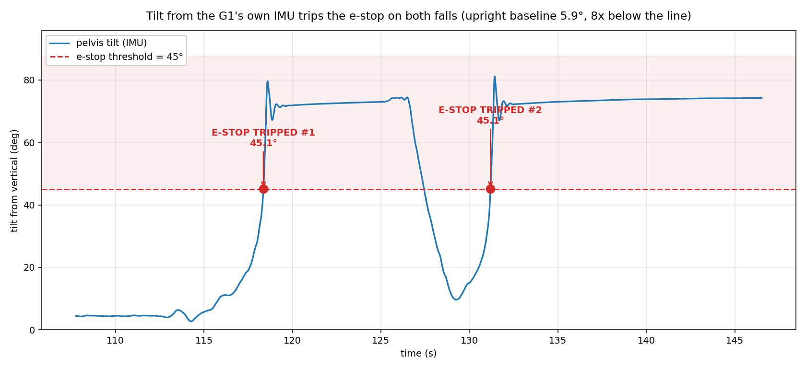

# G1 e-stop

A dimos module that watches `rt/lowstate` over DDS. Any e-stop event is one check: a predicate over a subscribed field plus one row. Every check, plus an operator button, latches the same `estop: Out[Bool]`, which kills the robot.

`dimos/robot/unitree/g1/g1_estop.py`, branch `aaryan/g1-estop`.

## Problem

Nothing in dimos consumes any hardware fault field, and no G1 task implements `ControlCoordinator.set_estop()`. The G1 has no e-stop.

## Solution

```
  rt/lowstate (DDS)
        |
        v
  G1EstopModule
    check 1  lowstate silent  \  priority order
    check 2  fallen           /  first match wins, latches
        |
        v
  estop: Out[Bool]
        |
        v
  MovementManager  (estop: In[Bool], 4 line gate)
    -> one zero Twist, cancel goal, ignore nav + teleop
```

DDS, because no LCM signal is common to kronknav and groot sim; `rt/lowstate` is, and it publishes in every FSM state including prep with motors disabled.

## Checks

Each e-stop event is one row.

| check | signal | trip | status |
|---|---|---|---|
| lowstate silent | `rt/lowstate` arrival | no LowState for > 0.5 s | shipped |
| fallen | IMU tilt | tilt > 45 deg | shipped |
| hung up / lifted | `knee_tau`, gated on a walking or standing state | near 6 Nm | measured, not built |
| operator button | manual trip | pressed | not built |

Hung up is a torque check: standing `knee_tau` p50 13.71 Nm, hung 2.64 Nm, no overlap. Tilt while hung peaked at 25 deg, so the tilt gate sees nothing.

Open: an earlier tilt gate (30 deg leads by 300 ms, 20 deg by 778 ms) or a gyro gate (1.0 rad/s leads by 102 ms; 2.0 rad/s never fired before the trip).

Configuration is per blueprint: which checks run, and their thresholds. Per robot is possible, not preferred.

## Not doing

A bare low torque rule. Prep mode reads `knee_tau` ~1.1 Nm with all 12 leg motors mode=1 Enable, motors off 0.18 Nm, so it would flag prep mode as a fault. The hung up check is gated on a walking or standing state for this reason.

## E-stop button

An operator trip beside the automatic checks. Same latched `estop: Out[Bool]`, same MovementManager gate, plus disarm. Proposed route: `ControlCoordinator.set_estop()` -> a G1 `set_estop` -> `G1GrootWBCTask.disarm()`.

## Appendix: demo



Two deliberate falls, 176,427 samples at ~780 Hz.

- Tilt crosses 45.1 deg twice, at t=118.36 s and t=131.19 s. Peak 81.2 deg, settling near 73 deg on the floor. Upright baseline 5.94 deg in prep mode, 8x margin to the 45 deg line; 2.03 deg standing in walk mode.
- Zero false trips: 351 publishes over 8 s standing at the shipped threshold, and 0 across a separate 10 minute activated standing baseline.
- At 45 deg the robot is already 65% unloaded (`knee_tau` 4.44 Nm against a 12.57 Nm standing median), and `knee_tau` < 10 Nm leads by 5269 ms. The tilt gate is a confirmation, not an early warning.
